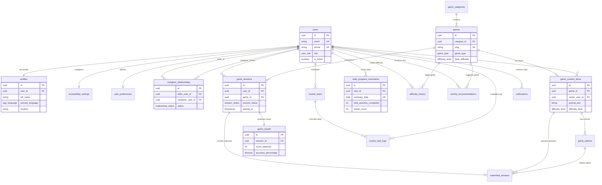

# Vanika Cognitive Care Platform — Entity-Relationship (ER) Architecture

## 📐 ER Overview & Cardinality Rules

This document presents the graphical and structural relationship maps for the **Vanika** relational data model.

### Key Relationship Cardinalities
- **`users` 1 ── 1 `profiles`**: Every user has exactly one profile record.
- **`users` 1 ── 1 `accessibility_settings`**: Every user has exactly one accessibility preference record.
- **`users` 1 ── 1 `user_preferences`**: Every user has exactly one gaming preference record.
- **`users` (Elder) 1 ── N `caregiver_relationships` N ── 1 `users` (Caregiver)**: Many-to-many relationship mapping elderly patients to authorized caregivers.
- **`game_categories` 1 ── N `games`**: Each game category contains multiple cognitive exercises.
- **`games` 1 ── N `game_content_items`**: Each exercise has a pool of questions/media items.
- **`users` (Caregiver/Elder) 0 ── N `game_content_items`**: Content items can optionally belong to a user (personal memory photos).
- **`game_content_items` 1 ── N `game_options`**: Each question has multiple selectable choices.
- **`users` 1 ── N `game_sessions` 1 ── N `submitted_answers`**: Each user logs session telemetry and individual item responses.
- **`game_sessions` 1 ── 1 `game_results`**: Completed sessions produce a single aggregated result record.
- **`users` 1 ── N `daily_progress_summaries`**: Daily automated performance rollups per user.
- **`users` 1 ── N `routine_tasks` 1 ── N `routine_task_logs`**: Scheduled routine tasks and their date-specific completion logs.
- **`users` 1 ── N `notifications`**: User notification inbox.

---

## 🧜‍♂️ Mermaid ER Diagram



---

## 🗺️ ASCII Relational Navigation Map

```
                          [ users ]
                             │
     ┌───────────────────────┼───────────────────────┬───────────────────────┐
     │ 1:1                   │ 1:1                   │ 1:1                   │ 1:N
     ▼                       ▼                       ▼                       ▼
[ profiles ]     [ accessibility_settings ]  [ user_preferences ]   [ caregiver_relationships ]
                                                                             (Elder & Caregiver)

                             [ users ]
                                │
          ┌─────────────────────┼─────────────────────┐
          │ 1:N                 │ 1:N                 │ 1:N
          ▼                     ▼                     ▼
  [ game_sessions ]    [ routine_tasks ]      [ notifications ]
          │                     │
          │ 1:1                 │ 1:N
          ▼                     ▼
  [ game_results ]     [ routine_task_logs ]
          │
          └───────────────────────────────────────────┐
                                                      │ (aggregates into)
                                                      ▼
                                       [ daily_progress_summaries ]
```

---

## 🔗 Foreign Key Cascade Strategy & Ownership Matrix

| Source Table | Foreign Key Column | Target Table | Cascade Action | Rationale |
|---|---|---|---|---|
| `profiles` | `user_id` | `users(id)` | `CASCADE` | Profile cannot exist without user account. |
| `accessibility_settings` | `user_id` | `users(id)` | `CASCADE` | Settings tied directly to user identity. |
| `user_preferences` | `user_id` | `users(id)` | `CASCADE` | Preferences tied directly to user identity. |
| `caregiver_relationships` | `elder_user_id` | `users(id)` | `CASCADE` | Clean up delegations when elder is deleted. |
| `caregiver_relationships` | `caregiver_user_id` | `users(id)` | `CASCADE` | Clean up delegations when caregiver is deleted. |
| `games` | `category_id` | `game_categories(id)` | `RESTRICT` | Prevent deletion of game categories in use. |
| `game_content_items` | `game_id` | `games(id)` | `CASCADE` | Delete questions if parent game is purged. |
| `game_content_items` | `owner_user_id` | `users(id)` | `CASCADE` | Delete personal memory photo items if user account is deleted. |
| `game_options` | `content_item_id` | `game_content_items(id)` | `CASCADE` | Delete choices when question item is deleted. |
| `game_sessions` | `user_id` | `users(id)` | `CASCADE` | Delete gameplay telemetry when user is purged. |
| `game_sessions` | `game_id` | `games(id)` | `RESTRICT` | Prevent deletion of game catalog item if historic sessions exist. |
| `submitted_answers` | `session_id` | `game_sessions(id)` | `CASCADE` | Purge answers when session is purged. |
| `submitted_answers` | `content_item_id` | `game_content_items(id)` | `RESTRICT` | Preserve historic question reference. |
| `submitted_answers` | `selected_option_id` | `game_options(id)` | `SET NULL` | Gracefully set null if option record is updated. |
| `game_results` | `session_id` | `game_sessions(id)` | `CASCADE` | 1:1 cleanup of summary result. |
| `daily_progress_summaries`| `user_id` | `users(id)` | `CASCADE` | Purge progress rollups when user account is deleted. |
| `routine_tasks` | `user_id` | `users(id)` | `CASCADE` | Purge scheduled tasks when user is deleted. |
| `routine_task_logs` | `routine_task_id` | `routine_tasks(id)` | `CASCADE` | Purge task log history when task is deleted. |
| `routine_task_logs` | `completed_by_user_id`| `users(id)` | `SET NULL` | Preserve execution record even if completing user is purged. |
